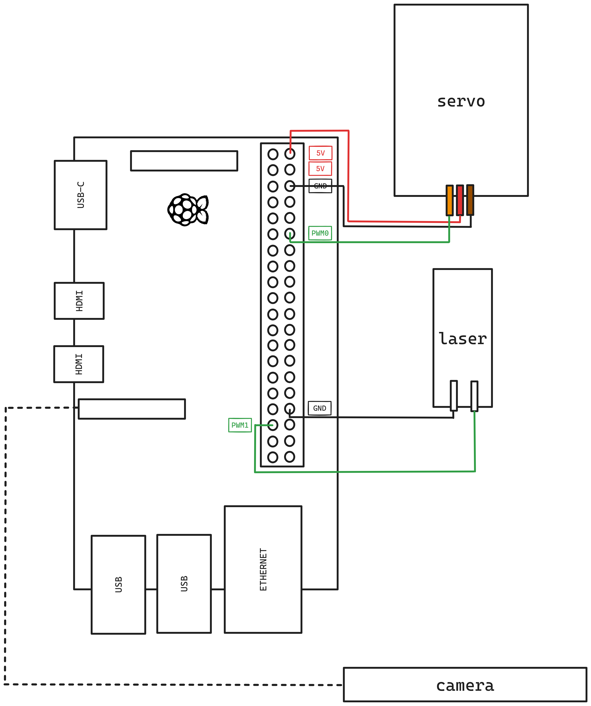

Setup hardware and software
===========================

Hardware and Equipment
----------------------

You will need the following hardware:
1. Raspberry pi - any model will do, so long as it has a slot for a pi 
camera.
2. Raspberry pi power cable (model dependant),
3. micro HDMI to HDMI cable,
4. (optional) peripherals for raspberry pi if using Diamond network,
5. Raspberry pi camera,
6. SD Card (64 GB)
7. DC Servo motor,
8. Diffraction grating,
9. A 3.3v laser,
10. cables for the raspberry pi camera connections,
11. (optional) housing for the experiment,
12. Blue-tac to keep things together

The pi requires a SD card to run, with an operating system (OS) booted onto it. 
You can use any OS, but for this tutorial it is reccomended to use [Raspberry 
Pi OS](https://www.raspberrypi.com/software/). Please refer to the `official guide`_
to set up your pi - it is recommended you use a 64 bit system. If you are on the
diamond network you'll need a spare monitor, keyboard and mouse as well (otherwise,
you may wish to use a headless raspberry pi setup).

Connecting Equipment
--------------------
Once you have an SD card with the correct operating system loaded onto it, the
individual components mentioned from the previous part can be put together in 
the following manner:

Please note the above diagram does not include wiring for connecting the pi
to peripherals or power.

Setting up the pi
-----------------

Boot up the pi and connect it to peripherals - a display (via the HDMI
cable), a keyboard and a mouse. Connect the pi to wifi (I used DLS-Visitor)
and open up a terminal.

Clone this repository onto a folder somewhere on your system::

    cd ~
    git clone https://github.com/rosesyrett/lunchbox.git

You may wish to install another IDE other than the default provided
on the pi (Thonny). VsCode is a good alternative which can be installed
by typing the following::

    sudo apt update
    sudo apt install code

See the `official documentation`_ for more details.

Installing necessary software
-----------------------------
For this tutorial you will need EPICs and scikit-image installed. Both of these 
installations take some time, so start them now while you read through these docs::

    mkdir $HOME/EPICS
    cd $HOME/EPICS
    git clone --recursive https://github.com/epics-base/epics-base.git
    cd epics-base
    make

    echo 'export EPICS_BASE=${HOME}/EPICS/epics-base' >> ~/.bashrc
    echo 'export EPICS_HOST_ARCH=$(${EPICS_BASE}/startup/EpicsHostArch)' >> ~/.bashrc
    echo 'export PATH=${EPICS_BASE}/bin/${EPICS_HOST_ARCH}:${PATH}' >> ~/.bashrc

After this is done, you should set up a virtual environment in the same
directory as the lunchbox code you checked out in the previous step, and pip 
install all the dev dependencies. Before doing this, you should install picamera2
globally::

    sudo apt update
    sudo apt upgrade
    sudo apt install -y python3-picamera2

Then go ahead and install dependencies in a virtual environment::

    cd ${HOME}/lunchbox
    python3 -m venv venv/ --system-site-packages
    source venv/bin/activate
    pip install --upgrade pip
    pip install -e .[dev]

Above, the ``system-site-packages`` flag will ensure that the created python
environment uses the globally available picamera2 library we installed in the
previous stage. To make sure this is the case, open up a python terminal and
try importing it::

    $ python
    >>> import picamera2

If this fails, deactivate the environment and try again. If that also fails,
your system didn't install ``python3-picamera2`` from the previous stage
correctly - refer to the `Picamera2 manual`_ to debug this issue. Otherwise,
if the above works outside of your venv but fails inside it, for some reason
the ``system-site-packages`` flag wasn't recognised. The easiest way to fix
this is to edit the ``pyvenv.cfg`` file at the root of your ``venv`` and
manually set ``include-system-site-packages`` to true.

Checking out the earliest commit
--------------------------------

At the moment, you should be inside a project that has the latest version of 
the lunchbox repo; this tutorial will take you through previous commits of it.
The following commit takes you to the start of this tutorial::

    git checkout ca60f0ce

At this point, src/lunchbox/__main__.py defines how to control the servo and
laser with PWM.

.. _official guide: https://www.raspberrypi.com/documentation/computers/getting-started.html
.. _official documentation: https://code.visualstudio.com/docs/setup/raspberry-pi
.. _Picamera2 manual: https://datasheets.raspberrypi.com/camera/picamera2-manual.pdf
